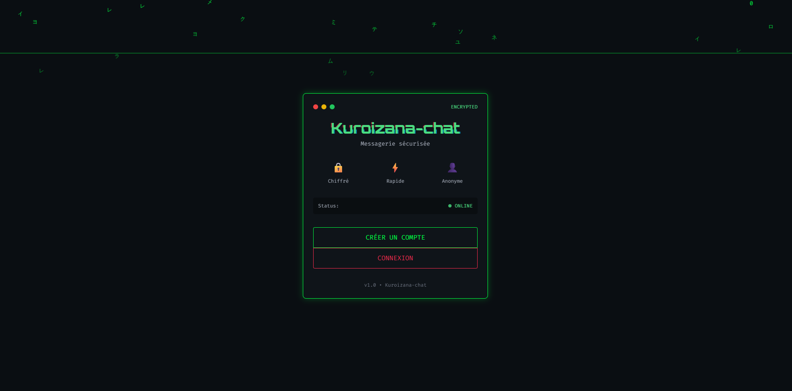
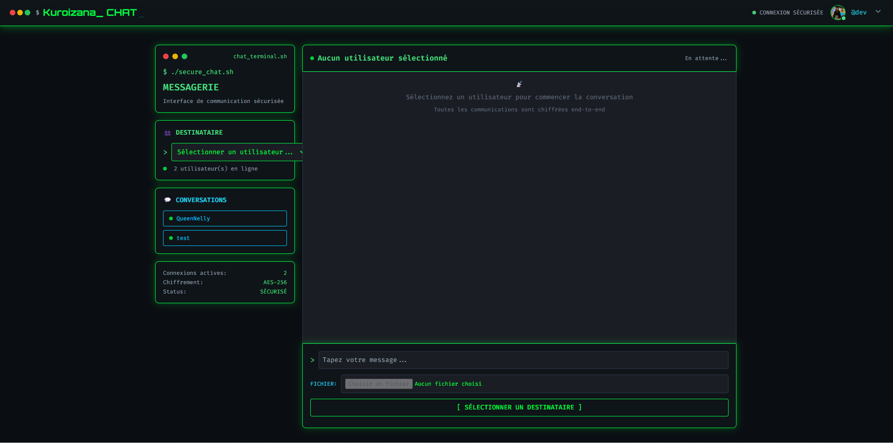
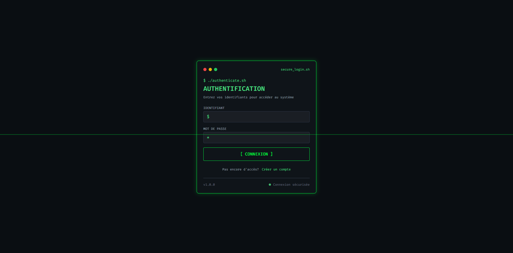
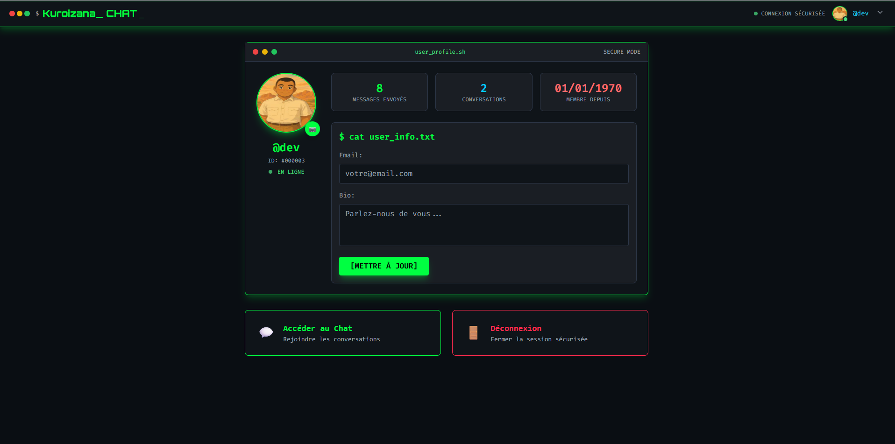

# 🖥️ SECURE_CHAT - Interface de Chat Hacker



Un système de chat sécurisé avec une interface inspirée des terminaux hacker et du style cyberpunk. Ce projet combine la fonctionnalité d'un chat moderne avec l'esthétique rétro-futuriste des films de science-fiction.

## 📋 Table des Matières

- [Aperçu](#aperçu)
- [Fonctionnalités](#fonctionnalités)
- [Technologies Utilisées](#technologies-utilisées)
- [Installation](#installation)
- [Configuration](#configuration)
- [Utilisation](#utilisation)
- [Structure du Projet](#structure-du-projet)
- [Captures d'Écran](#captures-décran)
- [Sécurité](#sécurité)
- [Contribution](#contribution)
- [Licence](#licence)

## 🎯 Aperçu

SECURE_CHAT est une application de messagerie instantanée développée en PHP avec une interface utilisateur unique inspirée des terminaux de hacking. L'application offre une expérience immersive avec des effets visuels cyberpunk, tout en maintenant des fonctionnalités de chat modernes et sécurisées.



### Caractéristiques principales :
- **Interface Terminal** : Design inspiré des terminaux Unix/Linux
- **Thème Cyberpunk** : Couleurs néon, effets de glitch, animations futuristes
- **Chat en Temps Réel** : Messagerie instantanée avec mise à jour automatique
- **Gestion d'Avatars** : Upload et gestion d'images de profil
- **Sécurité Renforcée** : Authentification sécurisée et protection des données

## ✨ Fonctionnalités

### 🔐 Authentification
- **Inscription sécurisée** avec validation des données
- **Connexion** avec gestion de session
- **Déconnexion automatique** après inactivité



### 💬 Messagerie
- **Chat en temps réel** entre utilisateurs
- **Envoi de fichiers** (images, documents)
- **Lightbox** pour visualiser les images en plein écran
- **Indicateurs de lecture** des messages
- **Historique des conversations**


### 👤 Profils Utilisateur
- **Gestion de profil** personnalisé
- **Upload d'avatar** avec redimensionnement automatique
- **Avatar par défaut** généré avec la première lettre du pseudo
- **Statistiques utilisateur** (messages envoyés, conversations)



### 🎨 Interface Utilisateur
- **Design responsive** adapté mobile et desktop
- **Effets visuels** : glitch, scan lines, animations
- **Navigation intuitive** avec menu déroulant
- **Thème sombre** optimisé pour les yeux

## 🛠️ Technologies Utilisées

### Backend
- **PHP 8.0+** - Langage de programmation principal
- **MySQL/MariaDB** - Base de données relationnelle
- **PDO** - Interface d'accès aux données
- **Sessions PHP** - Gestion de l'authentification

### Frontend
- **HTML5** - Structure des pages
- **CSS3** - Styles et animations
- **JavaScript (Vanilla)** - Interactions côté client
- **Tailwind CSS** - Framework CSS utilitaire

### Fonctionnalités Avancées
- **Upload de fichiers** avec validation sécurisée
- **Redimensionnement d'images** automatique
- **AJAX** pour les mises à jour en temps réel
- **Responsive Design** pour tous les appareils


## 📦 Installation

### Prérequis
- **Serveur web** (Apache, Nginx)
- **PHP 8.0** ou supérieur
- **MySQL 5.7** ou MariaDB 10.3+
- **Extension GD** pour le traitement d'images

### Étapes d'installation

1. **Cloner le projet**
```bash
git clone https://github.com/votre-username/secure-chat.git
cd secure-chat
```

2. **Configurer la base de données**
```sql
CREATE DATABASE secure_chat;
USE secure_chat;

-- Importer le fichier SQL fourni
SOURCE database/schema.sql;
```

3. **Configuration des permissions**
```bash
chmod 755 uploads/
chmod 755 uploads/avatars/
```

4. **Configurer les variables d'environnement**
```php
// includes/config.php
define('DB_HOST', 'localhost');
define('DB_NAME', 'secure_chat');
define('DB_USER', 'votre_utilisateur');
define('DB_PASS', 'votre_mot_de_passe');
```

## ⚙️ Configuration

### Structure de la base de données


```sql
-- Table des utilisateurs
CREATE TABLE users (
    id INT PRIMARY KEY AUTO_INCREMENT,
    username VARCHAR(50) UNIQUE NOT NULL,
    email VARCHAR(100),
    password VARCHAR(255) NOT NULL,
    avatar VARCHAR(255),
    bio TEXT,
    created_at TIMESTAMP DEFAULT CURRENT_TIMESTAMP
);

-- Table des messages
CREATE TABLE messages (
    id INT PRIMARY KEY AUTO_INCREMENT,
    sender_id INT NOT NULL,
    receiver_id INT NOT NULL,
    content TEXT,
    file_path VARCHAR(255),
    file_type VARCHAR(50),
    is_read BOOLEAN DEFAULT FALSE,
    created_at TIMESTAMP DEFAULT CURRENT_TIMESTAMP,
    FOREIGN KEY (sender_id) REFERENCES users(id),
    FOREIGN KEY (receiver_id) REFERENCES users(id)
);
```

### Configuration du serveur web

**Apache (.htaccess)**
```apache
RewriteEngine On
RewriteCond %{REQUEST_FILENAME} !-f
RewriteCond %{REQUEST_FILENAME} !-d
RewriteRule ^(.*)$ index.php [QSA,L]

# Sécurité
<Files "*.php">
    Order Allow,Deny
    Allow from all
</Files>
```

## 🚀 Utilisation

### Démarrage rapide

1. **Accéder à l'application**
   - Ouvrir votre navigateur
   - Aller à `http://localhost/secure-chat`

2. **Créer un compte**
   - Cliquer sur "Inscription"
   - Remplir le formulaire
   - Valider l'inscription


3. **Se connecter**
   - Utiliser vos identifiants
   - Accéder au chat principal

4. **Commencer à chatter**
   - Sélectionner un utilisateur
   - Envoyer des messages
   - Partager des fichiers

### Fonctionnalités avancées

**Upload d'avatar**
- Aller dans "Mon Profil"
- Cliquer sur l'icône caméra
- Sélectionner une image (max 2MB)
- Confirmer l'upload

**Envoi de fichiers**
- Dans le chat, cliquer sur l'icône fichier
- Sélectionner le fichier à envoyer
- Le fichier sera automatiquement partagé

## 📁 Structure du Projet

```
secure-chat/
├── assets/                 # Images et ressources
│   ├── banner.png
│   ├── chat-interface.png
│   └── ...
├── includes/              # Fichiers PHP communs
│   ├── config.php         # Configuration BDD
│   ├── session.php        # Gestion des sessions
│   └── functions.php      # Fonctions utilitaires
├── uploads/               # Fichiers uploadés
│   └── avatars/          # Avatars utilisateurs
├── database/              # Scripts SQL
│   └── schema.sql        # Structure de la BDD
├── index.php             # Page d'accueil
├── login.php             # Page de connexion
├── register.php          # Page d'inscription
├── chat.php              # Interface de chat
├── profile.php           # Page de profil
├── navbar.php            # Barre de navigation
├── upload_avatar.php     # Script d'upload
├── fetch_messages.php    # Récupération des messages
├── send_message.php      # Envoi de messages
└── README.md             # Documentation
```

## 📸 Captures d'Écran

### Interface de Chat

*Interface principale du chat avec liste des utilisateurs et zone de conversation*

### Lightbox pour Images

*Visualisation des images en plein écran avec informations détaillées*

### Menu Utilisateur

*Menu déroulant avec avatar et options utilisateur*

### Version Mobile

*Interface adaptée pour les appareils mobiles*

## 🔒 Sécurité

### Mesures de sécurité implémentées

- **Hachage des mots de passe** avec `password_hash()`
- **Protection CSRF** sur tous les formulaires
- **Validation des uploads** de fichiers
- **Échappement des données** pour éviter les injections SQL
- **Sessions sécurisées** avec timeout automatique
- **Validation côté serveur** de toutes les entrées

### Recommandations de déploiement

- Utiliser HTTPS en production
- Configurer un firewall approprié
- Mettre à jour régulièrement PHP et MySQL
- Sauvegarder régulièrement la base de données
- Monitorer les logs d'accès

## 🤝 Contribution

Les contributions sont les bienvenues ! Pour contribuer :

1. **Fork** le projet
2. Créer une **branche** pour votre fonctionnalité
3. **Commiter** vos changements
4. **Pousser** vers la branche
5. Ouvrir une **Pull Request**

### Guidelines de développement

- Respecter le style de code existant
- Commenter le code complexe
- Tester les nouvelles fonctionnalités
- Mettre à jour la documentation

## 📄 Licence

Ce projet est sous licence MIT. Voir le fichier `LICENSE` pour plus de détails.


**Développé avec ❤️ par [doniphane]**

*"Dans le cyberespace, la sécurité n'est pas une option, c'est une nécessité."*


```

